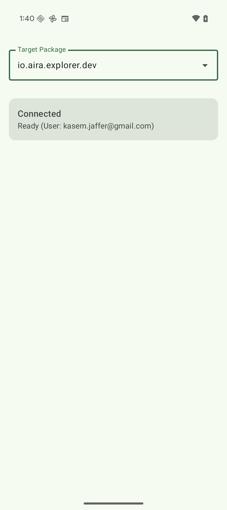
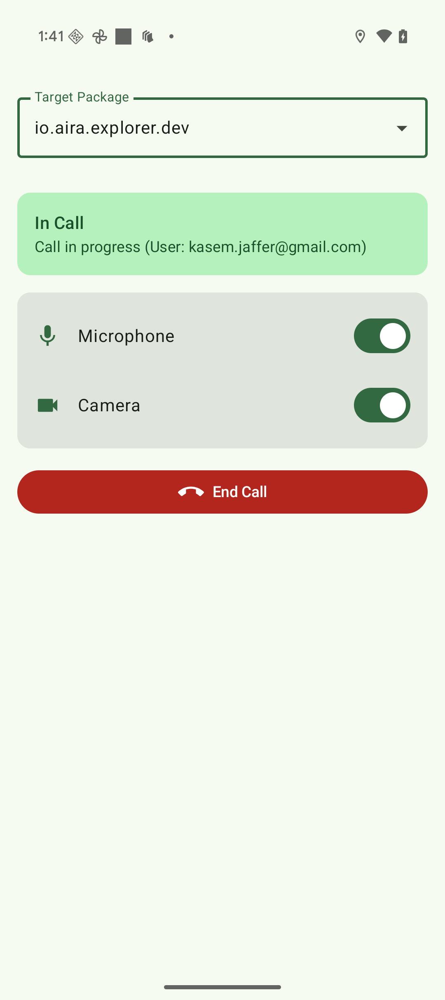

# Aira AIDL Integration Demo App

This is a demo application that demonstrates how to control Aira Explorer app using Android's AIDL (Android Interface Definition Language) interface. The app shows how to connect to Aira's service and control call features such as microphone, camera, and ending calls.

|  |  |
|-------------------------------------|-----------------------------------|

### Prerequisite: Permission Access

The custom permission required to bind to the Aira AIDL service (`io.aira.aira_call.permission.BIND_AIDL_SERVICE`) is defined with a protection level that restricts access to either:

1. Signature (your app must be signed with the **same signing key** as the Aira app), or
2. Privileged (your app must be a **privileged system app** placed on the device image under `/system/priv-app` and allow‑listed for the permission).

If your app is neither signed with the same certificate nor installed as a privileged system app, the bind attempt will fail with a `SecurityException` or the service connection will simply never succeed.

Helpful references:
- Android permission protection levels (Signature / SignatureOrSystem / Privileged): https://developer.android.com/guide/topics/manifest/permission-element#protectionLevel
- Privileged apps & allowlisting: https://source.android.com/docs/core/permissions/privileged-apps
- Permission allowlisting mechanism: https://source.android.com/docs/core/permissions/perms-allowlist

Summary of what you need to do:
- For development on a regular (non-rooted) device: You generally must have the app signed with the same key as the Aira app (not typically possible outside controlled partner programs).
- For OEM / enterprise deployments: Install your app as a privileged system app and ensure the permission is allow‑listed so the platform grants it automatically.
- For testing on an emulator / rooted device: You can push the APK into `/system/priv-app` (after remount) and reboot, then verify the permission is granted (`adb shell pm list permissions -g | grep aira` or `adb shell dumpsys package your.package.name`).

Without meeting one of these two conditions, the following usage steps will not work because the service binding will be denied by the system.

### Usage in Android Applications

To use Aira's AIDL interface in your Android application:

1. Copy the [`AiraAidlInterface.aidl`](app/src/main/aidl/io/aira/aira_call/AiraAidlInterface.aidl) file to your Android project's `src/main/aidl/io/aira/aira_call/` directory. The path and file name should match exactly. Otherwise, the service won't connect properly.

2. Enable AIDL in your app gradle file (gradle.kts)

    ```kts
      buildFeatures {
            aidl = true
        }
    ```
3. Add permission to your AndroidManifest.xml

    ```xml
    <uses-permission android:name="io.aira.aira_call.permission.BIND_AIDL_SERVICE" />
    ```
   
4. Build your app. The SDK tools will generate the IBinder interface file in your project's `gen/` directory.

5. Bind to the service in your Android code:

    ```kotlin
    private var airaService: AiraAidlInterface? = null
    
    private val serviceConnection = object : ServiceConnection {
        override fun onServiceConnected(name: ComponentName?, service: IBinder?) {
            airaService = AiraAidlInterface.Stub.asInterface(service)
        }
    
        override fun onServiceDisconnected(name: ComponentName?) {
            airaService = null
        }
    }
    
    // Bind to the service
    val intent = Intent().apply {
        setPackage("io.aira.explorer") // You can change this to any of our Aira apps. 
        action = "io.aira.aira_call.AiraAidlInterface"
    }
    bindService(intent, serviceConnection, Context.BIND_AUTO_CREATE)
    
    ```

6. Use the interface methods:

    ```kotlin
    // Check if in call
    val inCall = airaService?.isInCall() ?: false
    
    // Toggle microphone
    airaService?.setMicrophoneEnabled(true)
    
    // End call
    if (inCall) {
        airaService?.endCall()
    }
    ```